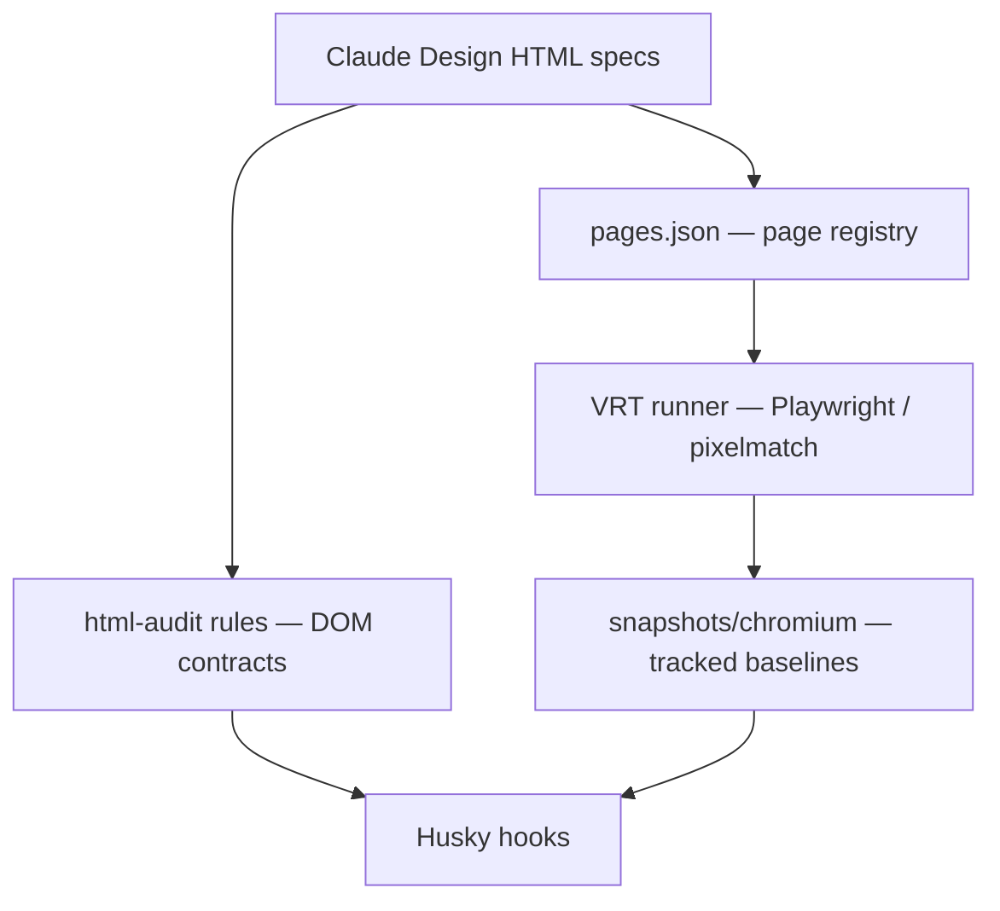

# 初めに

フリーランスのAndroid開発者の[とだやま.R](https://github.com/Corvus400)です。普段はモバイルアプリを開発していますが、最近は[Claude Design](https://www.anthropic.com/news/claude-design-anthropic-labs)で画面のデザイン仕様を作る機会が増えました。プロンプトやスクリーンショットを与えると、HTML/CSS/JS の動くデザインを生成してくれます。

ただ、出力された HTML をそのまま実装の手本にしようとすると、困ることがありました。綺麗に見えても「iPhone と iPad、Light と Dark、全部の状態をちゃんと要件どおり作ってある」という保証がどこにもないのです。手で実装に写経した瞬間から、デザインと実装は静かにズレ始めます。

この記事で書くのは、自分が試している次のようなやり方です。生成された HTML を「あとで参照するモック」ではなく、実装の唯一の正解（SSOT, Single Source of Truth）として Git で管理します。そのうえで、HTML 自身に「要件を満たしているか」を実行時に計算させ、「PASS の貼り付けによる偽装」まで成果物自身に封じさせる。こうしてデザインと実装の乖離（design drift）を止めます。題材は自分が運用している、架空の医薬品リファレンスアプリの[デザイン仕様リポジトリ](https://github.com/Corvus400/design-blueprint)です。

# AI が作ったデザインは「それっぽい」だけで、実装とすぐ乖離する

Claude Design はフロントエンドだけを作る道具で、出力は標準的な HTML/CSS/JS です（[Anthropic Labs の発表](https://www.anthropic.com/news/claude-design-anthropic-labs)）。だからこそ、出てきたファイルはそのまま Git に置けます。問題は中身の確からしさのほうです。

自分が扱っている検索画面の仕様は、1 画面につき 74 の状態を持ちます。縦向きの iPhone に 9 種類の状態があり、そこへ iPad などの幅クラス、さらに Light・Dark を掛け合わせていけば、人間が目視で「全部 OK」と言い切れる量ではありません。Claude Design はこの 74 状態を一息に描いてくれますが、その一枚一枚が要件どおりかは別の話です。

そして厄介なのは、ズレに誰も気づけないことです。デザインを更新したのに実装へ反映し忘れる。逆に、実装をリファクタした拍子に見た目が変わる。どちらも、横に並べて見比べる仕組みがなければ静かに進行します。これがいわゆる design drift で、生成 AI にデザインを任せると「要件を満たしたフリ（それっぽい見た目だけ）」が混ざりやすいぶん、より起きやすくなります。

# 生成された HTML を、モックではなく実装の入力契約として扱う

生成された HTML を「あとで眺める参照画像」だと思っている限り、乖離は止まりません。そうではなく、次の実装が従うべき入力契約として扱います。自分のリポジトリの方針ファイル（`AGENTS.md`）には、こう書いてあります。

> Treat implementation-backed HTML specs as code-generation inputs, not presentation mockups. A wrong spec can cause the next Codex implementation to build the wrong app.

HTML 仕様が間違っていれば、それを入力にした次の実装まるごとが間違う、ということです。だから仕様を「実装の SSOT」として Git で管理し、その描画結果を基準画像にして、変化を検出できる状態にしておきます。README にも「HTML 仕様を SSOT として管理」と明記しています。

全体の流れはこうです。Claude Design が HTML 仕様を生成し、それを Codex で実装向けに調整・監査して、`pages.json` で検証対象として登録します。あとは Playwright と pixelmatch で、描画結果の差分を取ります。これがいわゆる VRT（Visual Regression Test, 見た目の回帰テスト）です。取った基準画像を Git に追跡させ、Husky の Git hook で commit / push のたびに回します。



# HTML 自身に「要件を満たしているか」を計算させる

SSOT として置いた HTML に、要件を満たしているかを HTML 自身に検証させます。

具体的には、生成された HTML の中に検証レポートが埋め込みの JavaScript として入っていて、ページを開いた瞬間に実行されます。やっていることは、こうです。描画されたあとの実際の DOM を `querySelectorAll` で集め、`getBoundingClientRect()` で位置や大きさを実測します。そのうえで、要件を満たしているかを 1 行ずつ PASS / FAIL で計算します。手で「ここは OK」と書くのではなく、開くたびに測り直すわけです。コードのコメントにも、どの行も実際の DOM・正規表現・集計から計算していて、その場しのぎで PASS / FAIL を決めている行はない、と書いてあります。

下が、その検証レポートを実際に開いたところです。Flutter 版の検索画面です。上の緑のバナーが「ALL PASS 全 28 行 PASS. Frame count = 74.」で、その下に ID・Method・Result・Evidence の表が続きます。


Method 列の `C` は Computed、つまり描画後の DOM を実測した行です。`S` は Static で、HTML のソース文字列そのものに対する正規表現での確認（例えば「iOS 固有の語が紛れていないか」を `outerHTML` に対して見る）です。74 状態すべてを実描画したうえで、その実測から緑のバナーが出ています。

# 「PASS」と書けば騙せる穴を、成果物自身に塞がせる

ただ、検証を埋め込むと、すぐに意地悪な疑問が浮かびます。「`>PASS<` と手で書いておけば、緑になるのでは？」と。この穴を塞げているかが、検証レポートを信用できるかの分かれ目で、ここがこの仕組みでいちばん面白いところでした。

そこで iOS 版の仕様には、検証の偽装を検出する 2 つの監査行が入っています。

一つ目は VR-AUDIT-A です。検証 JavaScript は表に行を挿入する前に、表の中身（tbody）が空だったかどうかを記録しておきます。誰かが PASS の行を HTML に直接書き込んでおくと、開いた時点で tbody が空ではなくなり、`__INITIAL_TBODY_HTML === ""` が偽になって FAIL します。コードのコメントが言う「これが実際にハードコードした `<tr>` の偽装を防いでいる」部分です。

二つ目は VR-AUDIT-B です。ページのソース HTML を丸ごと取り込んでおきます。そこから `<script>` ブロックだけ取り除いた残りに、`>PASS<` や `>FAIL<`、`>ALL PASS<` という判定文字が出てこないかを走査します。

```js
var __auditScan = (__SOURCE_HTML || "").replace(
  /<script\b[\s\S]*?<\/script>/gi,
  "",
);
var __auditHits = [];
if (/>PASS</.test(__auditScan)) __auditHits.push(">PASS<");
if (/>FAIL</.test(__auditScan)) __auditHits.push(">FAIL<");
if (/>ALL PASS</.test(__auditScan)) __auditHits.push(">ALL PASS<");
```

判定文字が一つでもソースに直書きされていれば FAIL になります。バナーと表は、この検証 JavaScript が集計結果から動的に書き込むので、人が判定文字を貼り付ける余地がありません。

この検査器は、自分自身を引っかけないようにも書かれています。あるアイコンの検査で `"tune"` という語をソースから探すのですが、検査コード自身がソースに `"tune"` を残すと、それ自体が誤検出になってしまいます。そこで `String.fromCharCode(116, 117, 110, 101)` と実行時に組み立て、ソースに `"tune"` の文字列を残さないようにしています。

そして最後に集約の関門があり、すべての行と監査行が PASS のときだけ、緑のバナーが出ます。下が iOS 版の検証レポートの下のほうで、`VR-AUDIT-A`・`VR-AUDIT-B` から最後の集約行（「全 71 行 PASS」）までの帯です。


ただし、制約があります。VR-AUDIT-B は走査の前に `<script>` を取り除くので、封じられるのは「静的な成果物（HTML の地の部分）に判定を貼り付けて合格を偽装する」ことです。検証ロジックの JavaScript そのものを書き換えて、常に true を返すようにする攻撃は、これとは別の話で、各検証行の設計が正しいかという問題になります。なので、ここで言えるのは「あらゆる偽装を封じた」ではなく、「静的な成果物への判定の貼り付けという、いちばんやりがちな偽装を封じた」です。

それでも、これは効きます。生成 AI に画面を作り直させたとき、AI は緑のバナーをハードコードして「できました」と言えません。緑にするには、実際に要件を満たすしかない。検証が単なる「証明」から「要件を満たすことの強制」に変わるのは、この偽装封じがあるからです。

考え方そのものは新しくありません。対象が要件を満たすかを、対象自身に持たせたテストで確かめる、という発想は、[自己テストするコード](https://martinfowler.com/bliki/SelfTestingCode.html)や TDD でおなじみです。特に TDD で実装前にテストの失敗（red）を確かめるのは、テストが中身を伴わずに通っているだけ、という状態を避けるためです。今回の偽装検出も、緑のバナーが実体を伴わないまま出ていないかを確かめている点で、発想が近いと思っています。それを、AI が生成した HTML の成果物そのものに持ち込んだ形です。日本語で探した範囲では、AI が生成したデザイン仕様にこの種の自己監査を持たせる話は見当たりませんでした。

一点、取り違えないように補足します。この偽装検出（VR-AUDIT-A/B）が入っているのは iOS 版の仕様で、さきほどの Flutter 版のスクリーンショットには監査行はありません。Flutter 版は「手作業なしで全行を計算する」ところまでで、iOS 版が「さらに偽装も検出する」ところまで踏み込んでいます。同じ検索画面の、別々の段階だと思ってください。

# 自己監査を pre-commit のパイプラインに繋ぐ

「ページを開けば分かる」だけだと、開かなければ分からない、という弱さが残ります。そこで、この自己監査が commit のたびに自動で行われるようにします。pre-commit hook は 3 行です。

```sh
node scripts/lint-hook.mjs --staged || exit 1
node scripts/visual-review-hook.mjs --staged || exit 1
node scripts/vrt-hook.mjs --staged
```

Playwright がこのページを開いて撮ると、検証 JavaScript はページを開いた瞬間に実行されるので、緑の「ALL PASS」バナーごとスクリーンショットに写ります。だから VRT の基準画像には「ALL PASS だった証跡」が焼き込まれます。もし要件が崩れて検証が FAIL に転ぶと、バナーが赤く描画され、ピクセル差分がそれを捕まえます。

一方で、ブラウザを起動しない静的な監査もあります。`lint-hook` の中で実行される html-audit は、HTML を静的にパースして構造や `data-*` の契約値を固定します。これは JavaScript を実行しないので、検証の計算結果そのものは読めません。その代わりに、「検証レポート（`#sec-verify`）が消されていないか」「宣言された状態数が書き換えられていないか」を静的にロックします。実際、audit ルールには `Inline verification report must remain present.` という必須条件が入っています。

整理すると、性質の違う層が互いの死角を埋め合っています。

| 層                                        | 何を検証するか                                          | いつ実行されるか             |
| ----------------------------------------- | ------------------------------------------------------- | ---------------------------- |
| ① HTML 内の自己監査（検証行 + 偽装検出）  | 実 DOM を実測して要件を計算し、判定の貼り付けを検出する | ブラウザでページを開いた瞬間 |
| ② ピクセル VRT（Playwright + pixelmatch） | 描画のピクセル差分。①の緑バナーごと基準画像に焼き込む   | pre-commit / pre-push        |
| ③ 静的 DOM 契約 audit（html-audit）       | 構造・`data-*` の契約値・①が消えていないことを固定する  | pre-commit / pre-push        |
| ④ 全状態の visual review                  | 全状態の crop を生成して目視に乗せる                    | pre-commit                   |

①の検証結果は、ブラウザで JavaScript を実行しないと得られません。一方、静的な③は JavaScript を実行できません。だから③が「①の自己監査器が消されていない」ことを静的に保証し、①が「要件を満たすか」を実行時に計算します。そして②が「見た目の証跡」をピクセルで固定する。こうして、それぞれの苦手を別の層が補い合います。

# なぜ CI ではなく pre-commit か、そして VRT が証明できないこと

VRT を実行している人は、たいてい CI に配置すると思います。自分が pre-commit へ寄せているのは、staged のファイルだけ・変更されたプロジェクトだけに絞って速くしたいからです。そうすれば、commit する前に手元で気づけます。CI まで進んでから赤くなるより、手元で止まるほうが手戻りは小さい。

VRT は描画結果のピクセル比較なので、放っておくと不安定（flaky）になりがちです。そこへの対処はいくつか入れています。フォントを自前で持ってネットワーク待ちの揺れを消し、ページの読み込みが落ち着く（`networkidle`）まで待ってから撮る。アニメーションを止め、ページごとに差分の閾値を変える。そして、撮れた画像の寸法を揃えてから比べます。

そして、当然ながら VRT は万能ではありません。方針ファイルにもこうあります。

> VRT and visual manifests are evidence about the HTML artifact; they are not by themselves evidence that the artifact matches the implementation.

VRT が緑なのは「HTML が前回から変わっていない」ことの証拠であって、「HTML が実装と一致している」ことの証拠ではありません。だから VRT を通したからといって、実装まで正しいとは言えないのです。

# ピクセル差分が苦手な判断は AI に任せる

ピクセル差分は「1px でも違えば赤」になりがちで、意味のある変化なのか誤差なのかまでは判断してくれません。そこで VRT が差分を出したときだけ、Expected・Diff・Actual を横に並べた 1 枚の画像を作ります。これを画像で直接読める AI（Claude や Codex）に渡し、「仕様をどれくらい満たしているか」を `fulfillment_percent` として JSON で返させています。


安いほうの決定論的な関門（ピクセル差分）を引き金にして、高いほうの AI の判断は差分が出たときだけ呼ぶ。`fulfillment_percent` が 80 以上で、変更が仕様どおりなら基準画像の更新を勧める、という二段構えにしています。

# 最後に

ここまでの仕組みを一般化すると次のようになります。AI が作った成果物は、眺めるモックではなく実装の入力契約として扱う。その成果物自身に検証を埋め込んで、開くたびに自己証明させる。そして判定の貼り付けという楽な偽装を封じることで、検証を「強制」に変える。あとはそれを commit のたびに自動実行して、静かな乖離を止める。

これは Claude Design に限った話ではありません。v0 でも Figma Make でも、出力が標準的な HTML として手元に来るなら、同じやり方が効くはずです。AI に何かを作らせる場面が増えるほど、「それっぽくできたフリ」をどう見抜くかが効いてきます。成果物自身に証明させるという発想は、デザインに限らず転用が利くと思っています。

自分でも、最初は「生成された HTML をどう信じるか」という後ろ向きの問いから始まりました。それが「成果物に証明させればいい」という前向きな設計に変わったとき、急に扱いやすくなった感覚があります。同じように生成 AI の出力の確からしさで悩んでいる方の、手がかりになれば嬉しいです。もっと良いやり方をご存じの方がいたら、コメントで教えてもらえると助かります。
